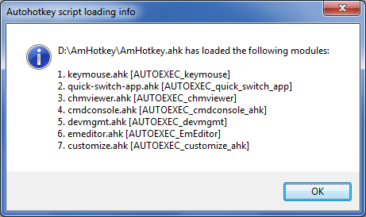

# AmHotkey: Modularized Autohotkey scripts

## QUICK START 

These scripts have been verified with Autohotkey 1.1.24, and new versions should be OK too.

First, you need to grab a Unicode version of Autohotkey executable(AutoHotkeyU32.exe or AutoHotkeyU64.exe) and place the EXE file in this directory. (download from http://www.autohotkey.com)

Second, Run AutoHotkeyU32.exe with AmHotkey.ahk as parameter. For example:

	D:\AmHotkey\AutoHotkeyU32.exe D:\AmHotkey\AmHotkey.ahk

I suggest creating an Explorer shortcut(.lnk) for easier launching of above command.

On first run, you'll see two popup message.

First dialog box tells that it has created `_more_includes_.ahk` for you, this file is generated/copied from `_more_includes_.ahk.sample` if it(`_more_includes_.ahk`) does not exist on AmHotkey startup.

Second dialog box tells what modules AmHotkey has loaded for you.

## What can these modules do for you?

There are quite a lot, to cite a few.

### AmHotkey.ahk 

Grab text from Windows Listview control, Static control, read-only Edit control, or Combobox.

For example, go to File/Folder property [Security] tab, hover mouse pointer on **Group or user names** Listview window, then press AppsKey+G, the text inside is grabbed to your system clipboard. Now you can paste it to your favorite text editor for further extracting or editing.

### keymouse.ahk

Right click AmHotkey Systry icon, execute **Configure Keymouse**, 

Here you can configure your keyboard ScrollLock to act as mouse left button, and Pause Key to act as mouse right button, etc.

### devmgmt.ahk

Note: This requires you to run AutoHotkeyU32.exe as Administrator, because the Device Manage UI is from a privileged process.

When viewing a device node's Property, [Details] tab, press F12, you'll see all Properties and its values are grabbed as a big piece of text.

 

## How do I add my own AHK script?

Good question. Adding your own AHK script should not conflict the benefit of using AmHotkey, unless some hotkey definitions conflict.

There are two ways.

### The trivial way

First way is convenient for adding trivial AHK scripts. Just open `customize.ahk` (this file should have existed if you have gone through the quick-start action), add your trivial scripts at end of it. 

For example, add this one line :

    RCtrl & RAlt:: Send {AppsKey}

Remember to do a "reload" so this new script actually takes effect. To reload, you can either right-click Systray Amhotkey icon, execute "Reload this Script", or, press keyboard hotkey `Win+Alt+R`(internally calls AHK `reload` command).

* Add them in customize.ahk. You make a copy of customize.ahk.sample with the name customize.ahk, and add new hotkeys at *end* of that file. This is convenient to test trivial hotkeys.
* Write a new "module" as foobar.ahk, and add foobar.ahk to _more_includes_.ahk . This is a good way to share your hotkey modules(named foobar) to others.

Useful hint: After adding/changing new hotkeys in customize.ahk or foobar.ahk, press Win+Alt+R to have them take effect. This has the same result as right-click Autohotkey taskbar tray icon and execute "Reload this Script" menu item.

### The modular way 

With the second way, you can compose your own module and share it with others, just like the stock modules provided by this AmHotkey project.

Step 1. Make a copy of `customize.ahk.sample`, name it `MyModule.ahk` for example. 

Step 2. Edit `MyModule.ahk`, change `AUTOEXEC_customize_ahk:` to `AUTOEXEC_MyModule_ahk:`, yes, we just need a unique word in the form of `AUTOEXEC_xxx_ahk`. AmHotkey searches for this word pattern to identify a "module" so that it can report it to you at startup.

Step 3. Edit `_more_includes_.ahk`, to include your new ahk, like shown below:

After editing, remember to `reload`. Now you will see from the popup dialog box, **MyModule.ahk** is on the list.

Of course, if you don't like some stock modules, just comment them out in `_more_includes_.ahk`. A comment line start with a semicolon. 

